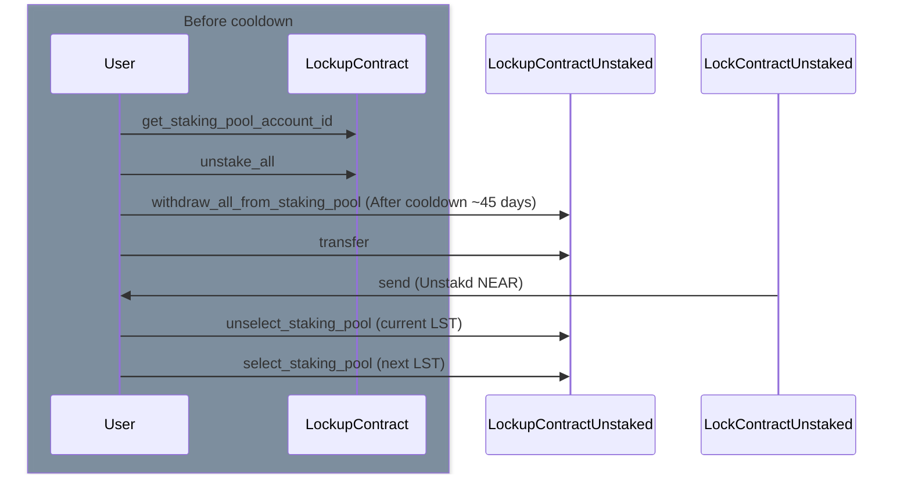

# VeNEAR Unstaking / Withdraw Flow

## Problem

The client will need two views in order to handle the complete withdraw flow. First, an unstaking interface that supports multiple LSTs; and the second that tracks the cooldowns for each of the respective tokens and allows the user to withdraw once this period has expired. While this user experience is not the smoothest, it is required to unstake every token in the lockup before initiating a withdraw. 

## Solution 1 (Recommended)

The most direct way to solve this problem would be to only support withdraw features for users who are using the supported LSTs in the UI (stNEAR, liNEAR, rNEAR). If a user has only some combination of these tokens then they will be able to use the withdraw feature. 

Furthermore to avoid situations where dust remains in the contract from unstaking (thus preventing a withdraw at a later point for other tokens), the UI will only call `unstake_all` on the contract. 

The first step would be to determine the currently selected staking pool from the user’s lockup by calling `get_staking_pool_account_id`

The above flow will need to repeated for each of the supported tokens if a balance is known. 

We can take a look at the existing PR: https://github.com/voteagora/agora-near/pull/234 and make changes where we disable partial unstaking and add a timestamp for when the user can call the withdraw method. Unfortunately, that will have to be a two-step process: where they call `withdraw_all_from_staking_pool` and then `transfer` to actually receive the funds. 

### Unsupported Edge cases

- If a user does not have one of the three listed tokens above in the lockup, they will not be to unstake and withdraw the NEAR from that particular LST
- Since the currently selected staking pool must be withdrawn before accessing other LSTs this does not allow users to do partial withdraws to avoid repeating steps.

## Solution 2

The shape of this solution is essentially identical with the exception that we open up support to all LSTs (namely legacy LSTs) that are not currently supported in the user interface. This comes with two main problems that do not have clear paths forward and would require additional consideration to implement. One, not every token has their cooldown period made available in an easily accessible interface on chain. 

That makes it difficult to communicate when the user can begin the unstake step for the any other token in their lockup since we do not know when they can call withdraw. 

Second, all these balances would need to be tracked in the UI, or at least the staking pool account ids. These would have to be retrieved by looking at the pool factory contract events and looking at every old and new deployment. We would also have to check the token balances in that particular lockup prior to starting the process above.

## Data considerations

- Tracking all known pool contracts by indexing the pool factories in addition to any arbitrary accounts being added to the whitelist contract
- Lack of knowledge of cooldown periods for discrete pools
- Displaying balances of all possible LSTs a user could own