# Semantic Search, Sort, and Filter for Delegates

Add Meilisearch-powered semantic search over delegate statements with hybrid (lexical + vector) search, sorting by VP/last vote/last delegation/herd alignment, filtering by endorsed/issueTypes, plus extend the existing Postgres GET /api/delegates with the same sort/filter options for non-search browsing.

## Current State

- **Delegate data**: `delegate_statements` table (statement, topIssues, socials, endorsed) FULL OUTER JOINed with `registered_voters` view (votingPower, participationRate)
- **Existing sorts**: `most_voting_power`, `least_voting_power`, weighted random (default)
- **Existing filters**: `endorsed`, `issue_type`
- **No text/semantic search exists**
- **~400 delegates** currently
- **Search today**: Exact address match only in [DelegatesSearch.jsx](src/components/Delegates/DelegatesSearch/DelegatesSearch.jsx) – redirects to `/delegates/{address}`
- **Filtering**: `filter_by`, `issue_type` – structured only, no text search on statements

## Chosen Approach: Meilisearch

**Stack**: Self-hosted Meilisearch + HuggingFace `sentence-transformers/all-MiniLM-L6-v2` (384 dims, open-source, no API cost)

### Why Meilisearch

1. **Hybrid search in one system** – Full-text (lexical) + semantic (vector) via `semanticRatio`; no need for separate vector DB + search engine
2. **Typo tolerance** – Users can misspell "governance" and still get results
3. **Fast** – Sub-50ms responses; delegates list stays responsive
4. **Flexible embedders** – OpenAI (best quality) or HuggingFace (open-source, no API cost)
5. **Vector store** – Native storage of embeddings; no external Pinecone/pgvector

## Architecture

```mermaid
flowchart TB
    subgraph Browse ["Browse (no text query)"]
        A["GET /api/delegates"] --> B["Postgres raw SQL"]
        B --> C["Conditional CTEs for aggregates"]
        C --> D["Sort/filter/paginate"]
    end
    subgraph Search ["Search (text query)"]
        E["POST /api/delegates/search"] --> F["Meilisearch hybrid search"]
        F --> G["Sort + filter via Meilisearch"]
        G --> H["Return results"]
    end
    subgraph SyncOnchain ["Sync On-chain Data (CRON, ~3h)"]
        I["Query Postgres aggregates"] --> J["Batch update Meilisearch docs"]
    end
    subgraph SyncStatement ["On Statement Write"]
        L["POST /api/delegates/statement"] --> M["Upsert Postgres"]
        M --> N["Upsert single doc in Meilisearch"]
    end
```



Two indexing paths because the data comes from two sources:

- **Statement data** (statement, topIssues, endorsed) changes via the backend API -- index immediately on write
- **On-chain data** (VP, lastVote, lastDelegation, herdAlignment, participationRate) changes via the fastnear indexer -- sync every ~3 hours

## Implementation Plan

### 1. Meilisearch setup

- **Self-host** (Docker): `docker run -d -p 7700:7700 getmeili/meilisearch`
- Enable vector store: `PATCH /experimental-features` with `{"vectorStore": true}`
- Env vars: `MEILI_HOST`, `MEILI_MASTER_KEY`

### 2. Index configuration

**Index**: `delegates`

#### Document shape (lean -- only what search/sort/filter needs):

```typescript
{
  id: string;                           // address (primary key)
  address: string;
  statement: string | null;
  topIssuesText: string;                // "governance: improve voting. technical: protocol upgrades."
  endorsed: boolean;
  issueTypes: string[];                 // ["governance", "technical"]
  votingPower: number;                  // numeric
  participationRate: number;
  lastVoteTimestamp: number | null;      // unix epoch seconds
  lastDelegationTimestamp: number | null;
  herdAlignmentRate: number | null;     // 0-1
}
```

#### Index settings:

- **Searchable**: `address`, `statement`, `topIssuesText`
- **Sortable**: `votingPower`, `lastVoteTimestamp`, `lastDelegationTimestamp`, `herdAlignmentRate`, `participationRate`
- **Filterable**: `endorsed`, `issueTypes`
- **Embedder**: HuggingFace `sentence-transformers/all-MiniLM-L6-v2`, 384 dims
  - Document template: `"Delegate statement: {{doc.statement}}. Top issues: {{doc.topIssuesText}}"`
  - Meilisearch handles both document and query embedding (no external embedding service needed)

### 3. On-chain Sync Job (every ~3 hours)

CRON job, `cron: "0 */3 * * *"`.

This job only syncs **on-chain derived fields** that the backend doesn't control:

1. Run a single Postgres query with CTEs to get all ~400 delegates with their aggregates:

```sql
WITH last_votes AS (
  SELECT voter_id, MAX(voted_at) as last_vote_at
  FROM fastnear.proposal_voting_history
  GROUP BY voter_id
),
last_delegations AS (
  SELECT delegatee_id, MAX(event_timestamp) as last_delegation_at
  FROM fastnear.delegation_events
  WHERE delegate_event = 'ft_mint'
  GROUP BY delegatee_id
),
proposal_outcomes AS (
  SELECT proposal_id,
    CASE
      WHEN for_voting_power >= against_voting_power
        AND for_voting_power >= COALESCE(abstain_voting_power, 0) THEN 0
      WHEN against_voting_power > for_voting_power
        AND against_voting_power >= COALESCE(abstain_voting_power, 0) THEN 1
      ELSE 2
    END as winning_option
  FROM fastnear.proposals WHERE has_votes = true
),
herd_alignment AS (
  SELECT pvh.voter_id,
    COUNT(*) FILTER (WHERE pvh.vote_option = po.winning_option)::float
      / NULLIF(COUNT(*), 0) as alignment_rate
  FROM fastnear.proposal_voting_history pvh
  JOIN proposal_outcomes po ON pvh.proposal_id = po.proposal_id
  GROUP BY pvh.voter_id
)
SELECT
  COALESCE(rv.registered_voter_id, ds.address) as address,
  rv.current_voting_power,
  rv.proposal_participation_rate,
  lv.last_vote_at,
  ld.last_delegation_at,
  ha.alignment_rate,
  ds.statement,
  ds."topIssues",
  ds.endorsed
FROM fastnear.registered_voters rv
FULL OUTER JOIN web2.delegate_statements ds ON rv.registered_voter_id = ds.address
LEFT JOIN last_votes lv ON lv.voter_id = COALESCE(rv.registered_voter_id, ds.address)
LEFT JOIN last_delegations ld ON ld.delegatee_id = COALESCE(rv.registered_voter_id, ds.address)
LEFT JOIN herd_alignment ha ON ha.voter_id = COALESCE(rv.registered_voter_id, ds.address)
```

1. Map rows to Meilisearch document shape
2. `index.updateDocuments(documents)` -- full batch upsert (~400 docs, completes in seconds)

Statement fields (`statement`, `topIssues`, `endorsed`) are included in the sync too since they're needed for the document but the **primary writer** for those fields is the on-write path. The sync just ensures consistency.

### 4. Search API route

- **Path**: `src/app/api/delegates/search/route.ts`

### Request

```typescript
POST /api/delegates/search
{
  q: string;                  // required, non-empty
  sort?: string[];            // e.g. ["votingPower:desc"]
  filter?: string;            // Meilisearch filter syntax, e.g. "endorsed = true"
  limit?: number;             // default 10
  offset?: number;            // default 0
  semanticRatio?: number;     // default 0.7
}
```

### Response

```typescript
{
  delegates: {
    address: string;
    statement: string | null;
    topIssuesText: string;
    endorsed: boolean;
    issueTypes: string[];
    votingPower: number;
    participationRate: number;
    lastVoteTimestamp: number | null;
    lastDelegationTimestamp: number | null;
    herdAlignmentRate: number | null;
  }[];
  total: number;
  query: string;
}
```

#### Controller logic

1. Validate `q` is non-empty, `limit` <= 100
2. Call `index.search(q, { sort, filter, limit, offset, hybrid: { semanticRatio, embedder: "default" } })`
3. Map hits to response shape
4. Return

---

### 5. Extend `GET /api/delegates` (Postgres path)

New `order_by` values (conditional CTEs, only built when needed):

| `order_by` value          | SQL                                              | CTE needed                                      |
| ------------------------- | ------------------------------------------------ | ----------------------------------------------- |
| `most_recent_vote`        | `ORDER BY lv.last_vote_at DESC NULLS LAST`       | `last_votes`                                    |
| `least_recent_vote`       | `ORDER BY lv.last_vote_at ASC NULLS FIRST`       | `last_votes`                                    |
| `most_recent_delegation`  | `ORDER BY ld.last_delegation_at DESC NULLS LAST` | `last_delegations`                              |
| `least_recent_delegation` | `ORDER BY ld.last_delegation_at ASC NULLS FIRST` | `last_delegations`                              |
| `most_aligned`            | `ORDER BY ha.alignment_rate DESC NULLS LAST`     | `herd_alignment` (includes `proposal_outcomes`) |
| `least_aligned`           | `ORDER BY ha.alignment_rate ASC NULLS FIRST`     | `herd_alignment`                                |

New response fields (returned alongside existing fields):

- `lastVoteAt` -- timestamp or null
- `lastDelegationAt` -- timestamp or null
- `herdAlignmentRate` -- float 0-1 or null

These fields are always returned (via LEFT JOINs to the aggregate CTEs) regardless of sort, so the frontend can display them. The CTEs are lightweight for ~400 delegates.

### 6. Frontend changes

- **DelegatesSearch.jsx**:
  - Detect if input looks like NEAR address (e.g. `*.near` or 64-char hex)
  - If address: keep current behavior (redirect to `/delegates/{address}`)
  - If free-text: debounced API call to `/api/delegates/search`, show results inline or navigate to search results
- **New hook**: `useDelegateSearch(query)` – calls search API, returns `{ data, isLoading, error }`
- **DelegateContent.tsx** / delegate list:
  - When `searchQuery` is set: render search results instead of paginated list
  - Clear search to return to normal list

## Options Considered (Not Chosen)

### Backend API + pgvector / Pinecone

**Stack**: Modify `near-api` to embed on write, store in Postgres pgvector or Pinecone.

**Why not**: pgvector and Pinecone are vector-only. To get typo tolerance and full-text matching you’d add Postgres FTS or another search layer, so you’re building hybrid search from two systems. Meilisearch does lexical + semantic in one place. Pinecone is also a separate managed service, so it doesn’t simplify the stack compared with self-hosted Meilisearch.

---

### Next.js + Pinecone / Supabase pgvector

**Stack**: Sync job populates Pinecone or Supabase; Next.js route embeds query and runs vector search.

**Why not**: Two systems (vector DB + optional full-text). Meilisearch gives hybrid (lexical + semantic) in one place. Pinecone/Supabase add another service and don’t provide typo-tolerant full-text natively.

---

### Algolia NeuralSearch

**Stack**: Algolia index, NeuralSearch for semantic ranking, sync from delegates API.

**Why not**: Higher cost per search. Vendor lock-in. Meilisearch is OSS and can be self-hosted; Algolia is managed-only.

---

### OpenSearch (k-NN + Neural Search plugin)

**Stack**: OpenSearch with k-NN vector field, Neural Search plugin for embeddings, ingest pipeline.

**Why not**: Heavier to operate (Elasticsearch-style stack). Multiple deployment options (local vs remote inference, ML nodes) add complexity. Meilisearch is lighter and faster to integrate.

---

### Full-text search only (Postgres FTS / Meilisearch lexical)

**Stack**: Postgres `to_tsvector` or Meilisearch without vector store.

**Why not**: No real semantic understanding. Queries like “voting power” won’t match “delegation” or “governance” by meaning. We want semantic search.

---

### Client-side semantic (Vercel AI SDK + in-memory)

**Stack**: Fetch all delegates, embed query + statements client-side, cosine similarity.

**Why not**: Doesn’t scale. Cost and latency grow with delegate count. Not suitable for production.

---
