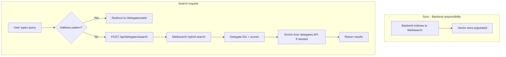

# Semantic Search for Delegate Statements

Implement semantic search over delegate statements using Meilisearch (vector store + hybrid search). Other options were evaluated but Meilisearch chosen for single-system hybrid search, typo tolerance, and fast results.

## Current State

- **Delegate data**: `statement` (free text, 4k chars) + `topIssues` (type/value pairs) per delegate
- **Backend**: External API (`near-api-*.run.app`) – [src/lib/api/constants.ts](src/lib/api/constants.ts), [src/lib/api/delegates/requests.ts](src/lib/api/delegates/requests.ts)
- **Search today**: Exact address match only in [DelegatesSearch.jsx](src/components/Delegates/DelegatesSearch/DelegatesSearch.jsx) – redirects to `/delegates/{address}`
- **Filtering**: `filter_by`, `issue_type` – structured only, no text search on statements

---

## Chosen Approach: Meilisearch

**Stack**: Self-hosted Meilisearch + HuggingFace `sentence-transformers/all-MiniLM-L6-v2` (384 dims, open-source, no API cost)

### Why Meilisearch

1. **Hybrid search in one system** – Full-text (lexical) + semantic (vector) via `semanticRatio`; no need for separate vector DB + search engine
2. **Typo tolerance** – Users can misspell "governance" and still get results
3. **Fast** – Sub-50ms responses; delegates list stays responsive
4. **Flexible embedders** – OpenAI (best quality) or HuggingFace (open-source, no API cost)
5. **Vector store** – Native storage of embeddings; no external Pinecone/pgvector

### Architecture

---

## Implementation Plan

### 1. Meilisearch setup

- **Self-host** (Docker): `docker run -d -p 7700:7700 getmeili/meilisearch`
- Enable vector store: `PATCH /experimental-features` with `{"vectorStore": true}`
- Env vars: `MEILI_HOST`, `MEILI_MASTER_KEY`

### 2. Index configuration

- Create index `delegates` (via SDK or backend on first write)
- Embedder: `sentence-transformers/all-MiniLM-L6-v2`, 384 dimensions. Meilisearch handles both doc and query embedding
- Searchable attributes: `address`, `statement`, `topIssues` (concatenated)
- Document template for embedding: `"Delegate statement: {{doc.statement}}. Top issues: {{doc.topIssuesText}}"`

### 3. Sync / indexing (backend responsibility)

**On write**: When a delegate creates/updates their statement via the backend, backend indexes that delegate to Meilisearch immediately

### 4. Search API route

- **Path**: `src/app/api/delegates/search/route.ts`
- **Method**: POST, body `{ q: string, limit?: number }`
- **Flow**:
  1. Validate query (non-empty, reasonable length)
  2. Call Meilisearch hybrid search:
  - `semanticRatio: 0.7` (tune: more semantic vs more lexical)
  1. Return `{ delegates: DelegateProfile[], total: number }`
  2. Enrich from delegates API

### 5. Frontend changes

- **DelegatesSearch.jsx**:
  - Detect if input looks like NEAR address (e.g. `*.near` or 64-char hex)
  - If address: keep current behavior (redirect to `/delegates/{address}`)
  - If free-text: debounced API call to `/api/delegates/search`, show results inline or navigate to search results
- **New hook**: `useDelegateSearch(query)` – calls search API, returns `{ data, isLoading, error }`
- **DelegateContent.tsx** / delegate list:
  - When `searchQuery` is set: render search results instead of paginated list
  - Clear search to return to normal list

### 6. Dependencies

- `meilisearch` (official JS SDK) – add to package.json

---

## Options Considered (Not Chosen)

### Backend API + pgvector / Pinecone

**Stack**: Modify `near-api` to embed on write, store in Postgres pgvector or Pinecone.

**Why not**: pgvector and Pinecone are vector-only. To get typo tolerance and full-text matching you’d add Postgres FTS or another search layer, so you’re building hybrid search from two systems. Meilisearch does lexical + semantic in one place. Pinecone is also a separate managed service, so it doesn’t simplify the stack compared with self-hosted Meilisearch.

---

### Next.js + Pinecone / Supabase pgvector

**Stack**: Sync job populates Pinecone or Supabase; Next.js route embeds query and runs vector search.

**Why not**: Two systems (vector DB + optional full-text). Meilisearch gives hybrid (lexical + semantic) in one place. Pinecone/Supabase add another service and don’t provide typo-tolerant full-text natively.

---

### Algolia NeuralSearch

**Stack**: Algolia index, NeuralSearch for semantic ranking, sync from delegates API.

**Why not**: Higher cost per search. Vendor lock-in. Meilisearch is OSS and can be self-hosted; Algolia is managed-only.

---

### OpenSearch (k-NN + Neural Search plugin)

**Stack**: OpenSearch with k-NN vector field, Neural Search plugin for embeddings, ingest pipeline.

**Why not**: Heavier to operate (Elasticsearch-style stack). Multiple deployment options (local vs remote inference, ML nodes) add complexity. Meilisearch is lighter and faster to integrate.

---

### Full-text search only (Postgres FTS / Meilisearch lexical)

**Stack**: Postgres `to_tsvector` or Meilisearch without vector store.

**Why not**: No real semantic understanding. Queries like “voting power” won’t match “delegation” or “governance” by meaning. We want semantic search.

---

### Client-side semantic (Vercel AI SDK + in-memory)

**Stack**: Fetch all delegates, embed query + statements client-side, cosine similarity.

**Why not**: Doesn’t scale. Cost and latency grow with delegate count. Not suitable for production.

---
